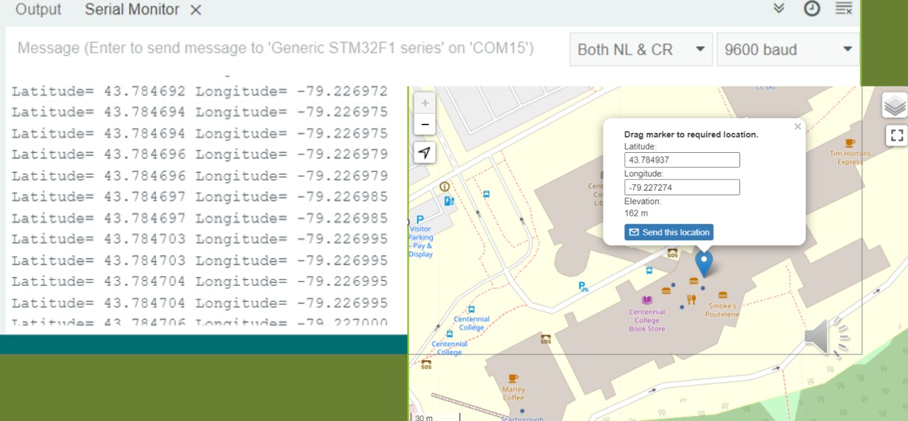
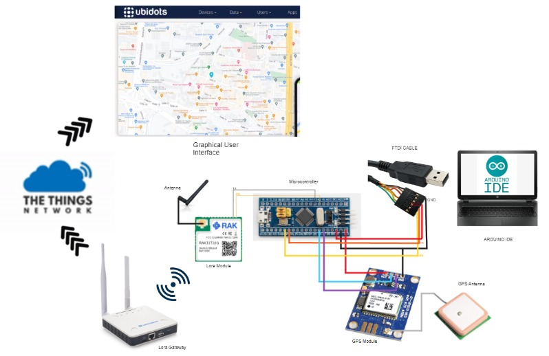

# LoRa-Based GPS Tracking Device for Elderly Care

## Project Overview

This project presents an assistive GPS tracking system designed to help caregivers monitor elderly individuals living with dementia or Alzheimer's who may be at risk of wandering or becoming disoriented.

The system combines GPS, LoRa wireless communication, IoT technology, cloud services, and a web based tracking interface to provide caregivers with access to the user's location. A tracking device can be worn by an individual or attached to a wheelchair or walker, allowing location data to be collected and transmitted through a LoRa gateway to a cloud based service.

The collected location data is then made available through a tracking website, where caregivers can monitor the individual's location and interact with the tracking system. The project also incorporates geo fencing functionality to define a designated safe area and generate alerts when the tracked individual moves beyond the defined boundary. An emergency button provides an additional safety mechanism, allowing the individual to trigger an alert and transmit their location to the caregiver.

The combination of GPS tracking, long range low power LoRa communication, IoT configuration, location mapping, geo fencing, and emergency alerts demonstrates how connected technologies can be integrated into an assistive monitoring system for elder care environments such as retirement homes.

The project was developed as a team technical project, with my primary contributions focused on software development, IoT configuration, GPS tracking functionality, and the implementation of the tracking map using Ubidots + The Things Network.

## My Contribution

My primary contributions to the project were software development, IoT configuration, and the tracking map functionality.

I worked on:

- Software development for the tracking system
- IoT configuration
- GPS tracking functionality
- Location data integration
- Tracking map functionality using "The Things Network"
- Integration of the tracking functionality with the user-facing interface

## Key Features

- 📍 GPS location tracking
- 📡 LoRa wireless communication
- 🗺️ Real-time location visualization
- 🚨 Emergency button and alerts
- 🔵 Geo-fencing functionality
- 📱 Guardian monitoring interface
- ☁️ Cloud-based location data
- 🔋 Low-power tracking design

## System Architecture

The overall system was designed around the following flow:

The project documentation describes the tracking device sending location data through the LoRa gateway to cloud services, where the location could be accessed through a website. The system also included geo-fencing and emergency alerts.

## Technologies & Components

- GPS
- LoRa
- IoT
- Microcontroller
- Cloud Services
- The Things Network
- Ubidots
- Location Mapping
- Geo-fencing

## Project Demonstration

A demonstration of the project was presented during the Tech Fair.

🎥 **[Watch the Project Demonstration](https://www.acadiate.com/ee/SETAS/Electronics_Projects?view=std&showcase=2123084856)**

## Project Documentation

Additional project documentation, system diagrams, and supporting materials can be found in the repository.

## Project Context

This project was developed as a team project for:

**ETEC326: Technical Project**  
Engineering Technology & Applied Science  
Centennial College  

### Team

- Leisel Kim Enriquez
- Wilne John Biol
- Lorenzo Zaragoza III
- Lezhao Huang
- Julian Campo 

## Showcase Notice

This repository is a portfolio showcase of the project, its architecture, functionality, documentation, and my contributions.

The original implementation/source code is not included in this repository.

Original project materials are presented for portfolio and demonstration purposes and are not intended for reuse or redistribution without permission.
