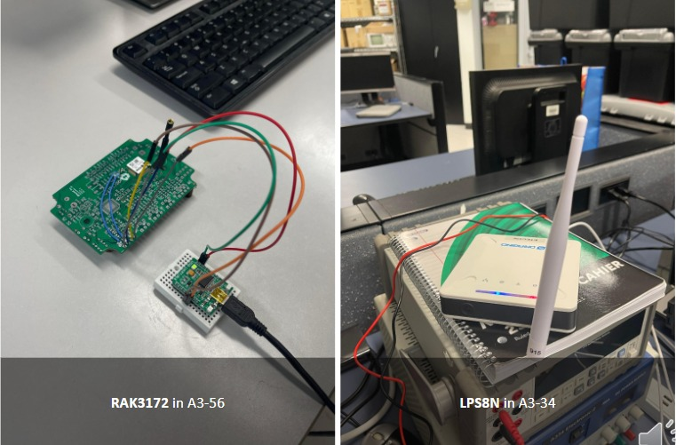

# LoRa-Based GPS Tracking Device for Elderly Care

## Project Overview

A team project developed at Centennial College focused on designing an assistive GPS tracking system for elderly individuals with dementia or Alzheimer's.

The system was designed to allow caregivers to monitor an elderly person's location through a tracking device, LoRa communication, cloud services, and a user-facing tracking interface.

The project included GPS location tracking, geo-fencing, emergency alerts, and location visualization.

## My Contribution

My primary contributions to the project were software development, IoT configuration, and the tracking map functionality.

I worked on:

- Software development for the tracking system
- IoT configuration
- GPS tracking functionality
- Location data integration
- Tracking map functionality using "The Things Network"
- Integration of the tracking functionality with the user-facing interface

## Key Features

- 📍 GPS location tracking
- 📡 LoRa wireless communication
- 🗺️ Real-time location visualization
- 🚨 Emergency button and alerts
- 🔵 Geo-fencing functionality
- 📱 Guardian monitoring interface
- ☁️ Cloud-based location data
- 🔋 Low-power tracking design

## System Architecture

The overall system was designed around the following flow:

GPS Tracking Device  
↓  
LoRa Communication  
↓  
LoRa Gateway  
↓  
Cloud Server  
↓  
Tracking Website / Map  
↓  
Guardian

The project documentation describes the tracking device sending location data through the LoRa gateway to cloud services, where the location could be accessed through a website. The system also included geo-fencing and emergency alerts.

## Technologies & Components

- GPS
- LoRa
- IoT
- Microcontroller
- Cloud Services
- InofThings
- Location Mapping
- Geo-fencing

## Project Demonstration

A demonstration of the project was presented during the Tech Fair.

🎥 **[Watch the Project Demonstration](YOUR_VIDEO_LINK)**

## Project Documentation

Additional project documentation, system diagrams, and supporting materials can be found in the repository.

## Project Context

This project was developed as a team project for:

**ETEC326: Technical Project**  
Engineering Technology & Applied Science  
Centennial College  

### Team

- Leisel Kim Enriquez
- Wilne John Biol
- Lorenzo Zaragoza III
- Lezhao Huang
- Julian Campo 

## Showcase Notice

This repository is a portfolio showcase of the project, its architecture, functionality, documentation, and my contributions.

The original implementation/source code is not included in this repository.

Original project materials are presented for portfolio and demonstration purposes and are not intended for reuse or redistribution without permission.
